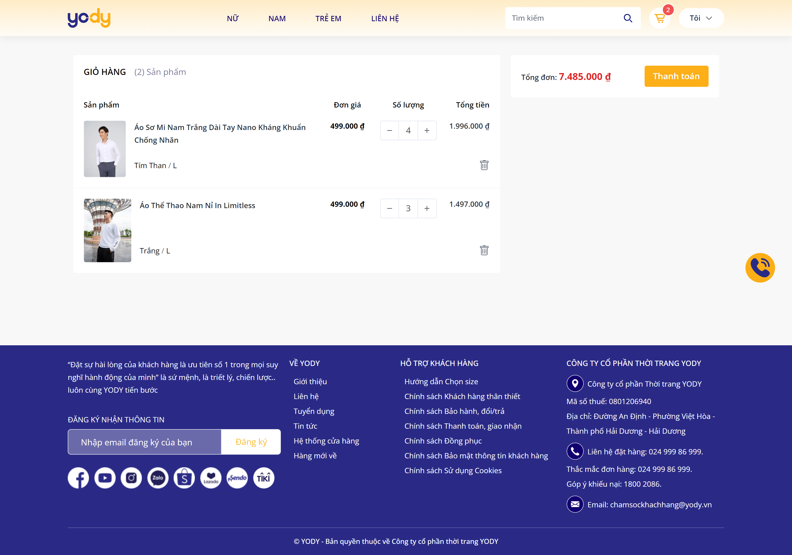
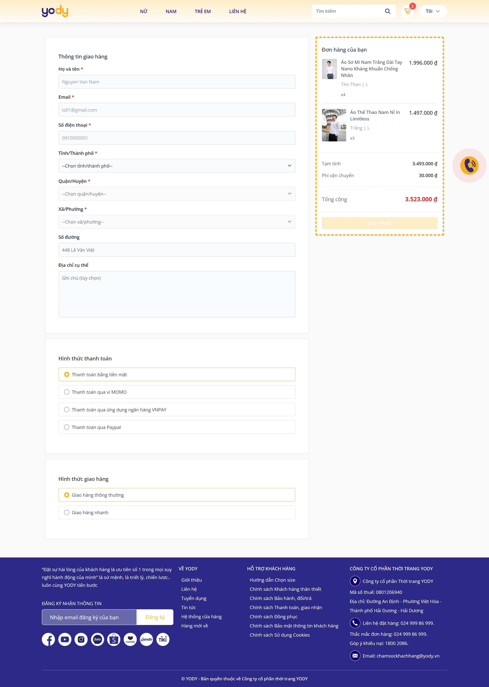
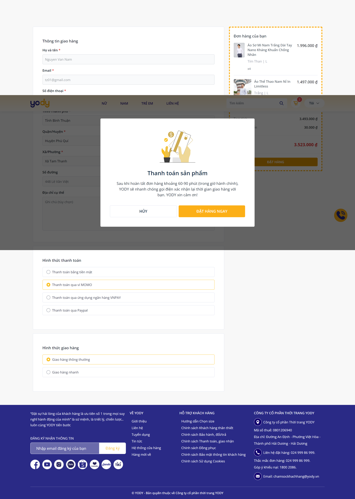
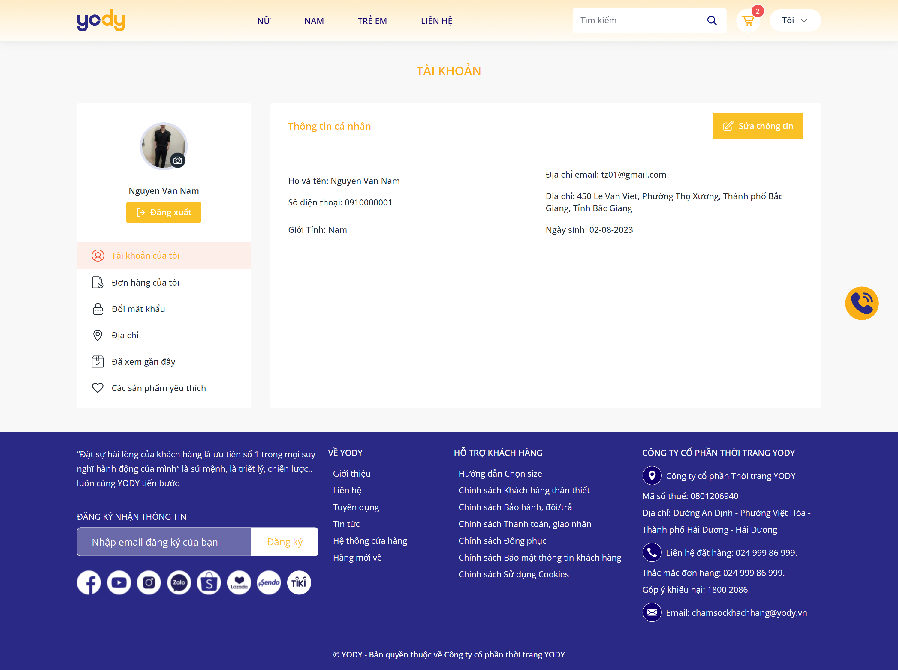
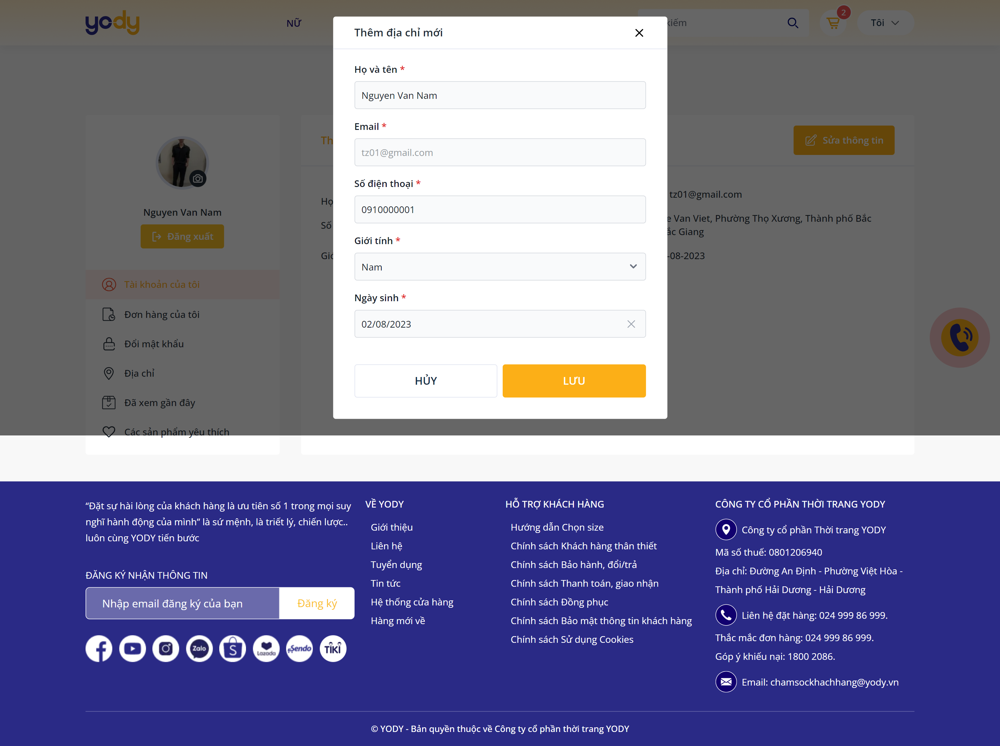
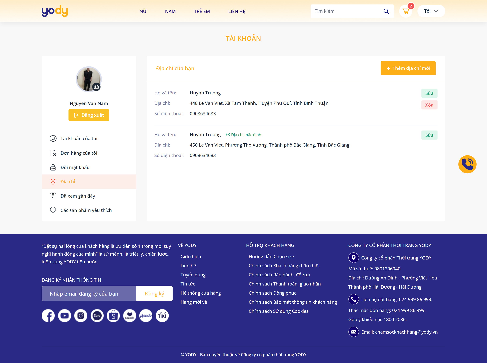
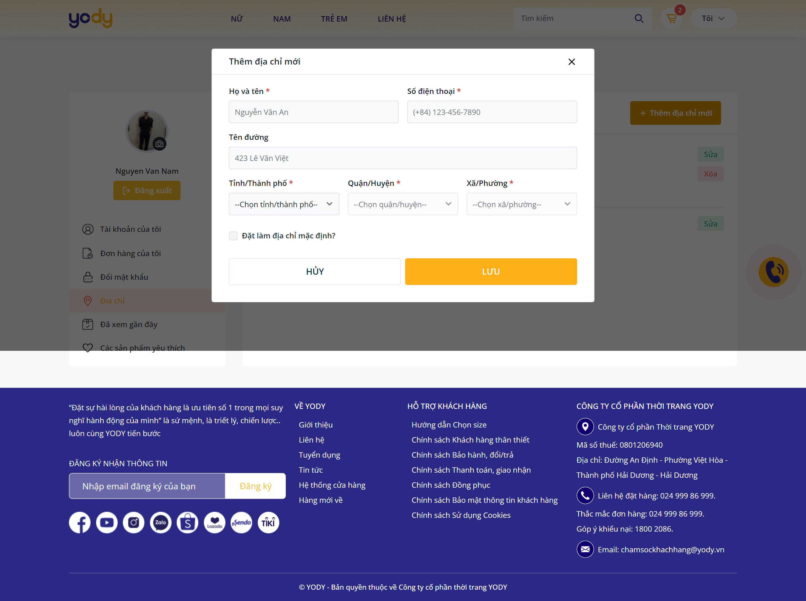
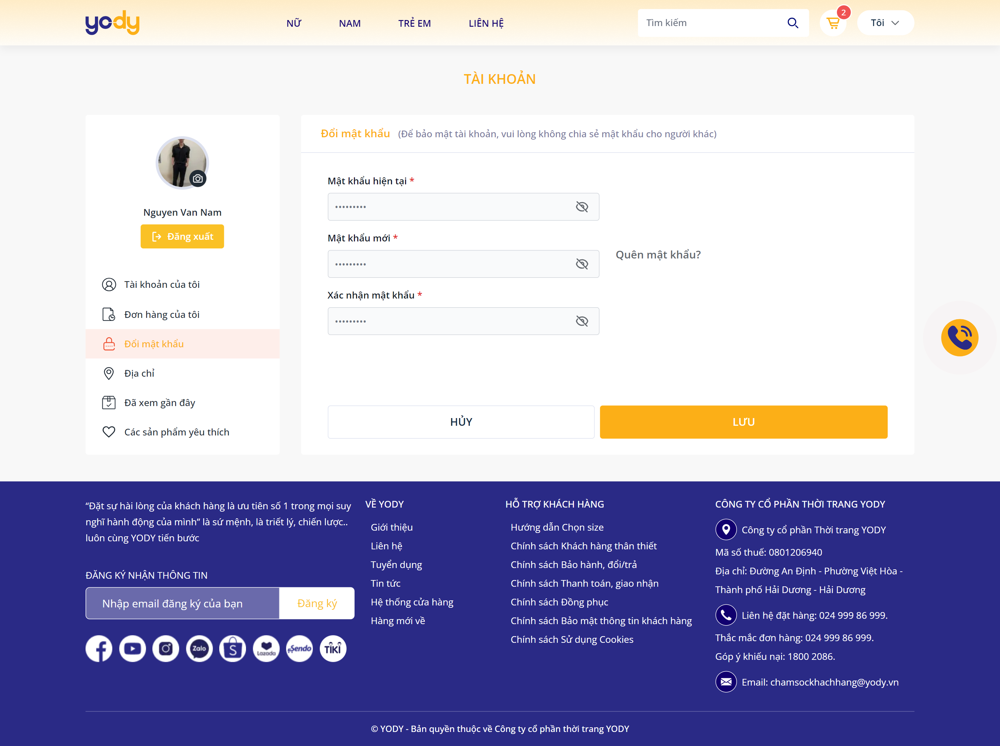
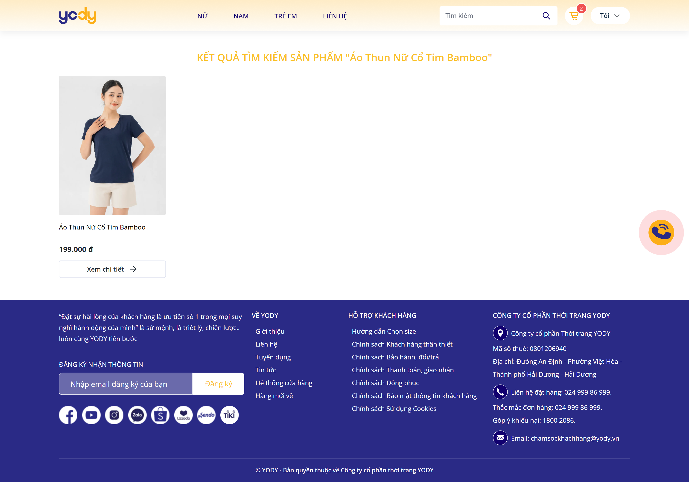

## YODY STORE (Clone WEBSITE YODY)

Clone from WEBSITE **YODY**
> [https://yody.vn/](https://yody.vn/)

- [YODY STORE (Clone WEBSITE YODY)](#yody-store-clone-website-yody)
    - [Application interface YODY Store](#application-interface-yody-store)
    - [Read docs API (SWAGGER)](#read-docs-api-swagger)
    - [Origin API](#origin-api)

---

#### Application interface YODY Store

1. **Home Page**

2. **Product List Page**

3. **Product Detail Page**

4. **Cart Page**

5. **Checkout Page**

6. **Information Account**

- Information Account:

- Address Account:

- Change Password:

- Recently Products:

- Favorite Products:

7. **Contact**

8. **Search Products**

---

#### Read docs API (SWAGGER)
[https://api-yody-store.vercel.app/api/docs](https://api-yody-store.vercel.app/api/docs)

---

#### Origin API
[https://api-yody-store.vercel.app/api/v1](https://api-yody-store.vercel.app/api/v1)
