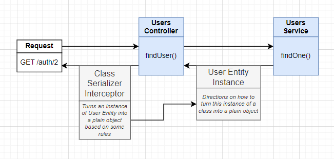
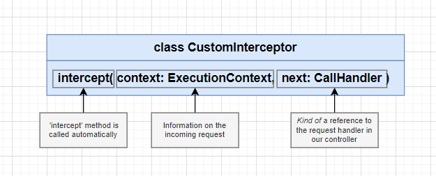
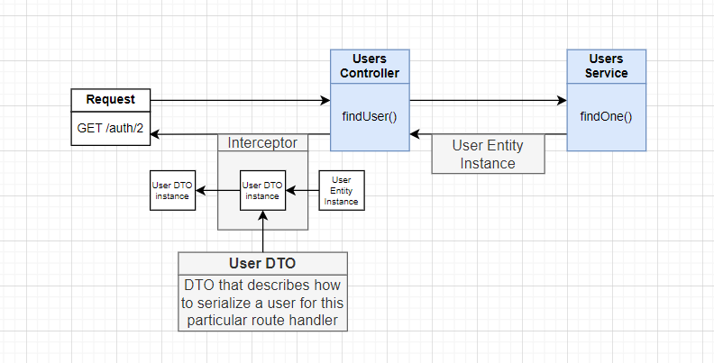

### MIDDLEWARE IN NESTJS

> [https://docs.nestjs.com/middleware](https://docs.nestjs.com/middleware)

1. **Create file middleware and Setup**

```ts
// authentication.middle.ts

import { AuthService } from './auth/auth.service'
import { RequestUser } from './models'
import { UsersService } from './users/users.service'
import { Injectable, NestMiddleware, UnauthorizedException } from '@nestjs/common'
import { NextFunction, Response } from 'express'

@Injectable()
export class AuthenticationMiddleware implements NestMiddleware {
    constructor(
        private readonly userService: UsersService,
        private readonly authService: AuthService
    ) {}

    async use(req: RequestUser, res: Response, next: NextFunction) {
        const authorization = req.headers['authorization']
        if (!authorization) {
            throw new UnauthorizedException("You don't login")
        }
        const token = authorization.split(' ')[1]
        const decode = this.authService.verifyToken(
            token,
            process.env.SECRET_ACCESS_TOKEN
        )

        const user = await this.userService.findOne(decode.id)
        req.user = user
        next()
    }
}
```

2. **Then we should import it into app.module.ts file**

- We can add lots of `middleware` into `consume.apply`

```ts
// app.module.ts

export class AppModule implements NestModule {
    configure(consumer: MiddlewareConsumer) {
        consumer.apply(AuthenticationMiddleware).forRoutes(
            {
                path: 'users/profile',
                method: RequestMethod.GET,
            },
            {
                path: 'users/me',
                method: RequestMethod.DELETE,
            },
            ...
        )

        consumer
            .apply(AuthenticationMiddleware, RestrictMiddleware.forRoles(['admin']))
            .exclude(
                'users/profile',
                {
                    path: 'orders/:userId',
                    method: RequestMethod.GET,
                },
                ...
            )
            .forRoutes(
                UsersController,
                OrdersController,
                RolesController,
                CategoriesController,
                ColorsController,
                AddressController
            )
    }
}
```

---

### INTERCEPTOR IN NESTJS

> [https://docs.nestjs.com/interceptors](https://docs.nestjs.com/interceptors)

1. **Exclude response properties**



- Using `class-transformer` for file `.entity.ts`

```ts
import { Exclude } from 'class-transformer'
import { Entity } from 'typeorm'

@Entity()
export class User {
    ...

    @Column()
    @Exclude()
    password: string
} 
```

- Then you goes to file `controller`

```ts
import { UseInterceptors, ClassSerializeInterceptor } from '@nestjs/common'

@UseInterceptors(ClassSerializeInterceptor)
@Get('/:id')
async findUser(@Param(':id') id: string) {
    const user = await this.userService.findOne(id)
    if(!user) {
        throw new NotFoundInterceptor('Not found this user')
    }

    return user
}
```

2. **How to build interceptor**

- **Interceptor** can be applied to a single handler, all the handlers in a controller, or globally.



```ts
import {
    CallHandler,
    ExecutionContext,
    Injectable,
    NestInterceptor,
} from '@nestjs/common'
import { Observable } from 'rxjs'
import { map } from 'rxjs/operators'

@Injectable()
export class SerializeInterceptor implements NestInterceptor {
    intercept(context: ExecutionContext, next: CallHandler): Observable<any> {
        // Run something before request is coming
        // console.log('Before handling it: ', context)

        return next.handle().pipe(
            map((data) => {
                // Run something before response is send out
                return {
                    data: {
                        ...data,
                    },
                }
            })
        )
    }
}
```

3. **Serialize Interceptor**



**user.dto.ts**
```ts
import { Expose } from 'class-transformer'

// Expose: It is used to indicate that the property should be included in the transformation process when converting objects between different data formats, such as JSON, class instances, or plain objects.

export class UserDto {
    @Expose()
    email: string

    @Expose()
    password: string
}
```

- Then, you can apply dto to transform data

```ts
import { plainToClass } from 'class-transformer'
import { UserDto } from './user.dto.ts'

// plainToClass: allows you to convert plain objects (such as JSON data) into instances of a specified class, applying decorators and transformations defined in that class.

// excludeExtraneousValues options: used to control how the transformation handles additional properties that exist in the source plain object but are not defined as properties in the target class.

@Injectable()
export class SerializeInterceptor implements NestInterceptor {
    intercept(context: ExecutionContext, next: CallHandler): Observable<any> {
        return next.handle().pipe(
            map((data) => {
                return plainToClass(UserDto, data, {
                    excludeExtraneousValues: true,
                })
            })
        )
    }
}
```

4. **How to add interceptor into router in the controller file**

```ts
import { UseInterceptors, Controller } from '@nestjs/common'

@Controller('users')
export class UserController {
    ...

    @UseInterceptors(new SerializeInterceptor(UserDto)) // SerializeInterceptor must have constructor dto to import it
    @Get('/')
    async getAllUser() {
        ....
    }
}
```

- You can use for **global interceptor** like this:

```ts
// add it into app.module.ts

providers: [
        AppService,
        {
            provide: APP_INTERCEPTOR,
            useClass: SerializeInterceptor,
        },
    ],
```


5. **Wrapping the interceptor in a decorator**

```ts
// add it into file .interceptor.ts 
import { UseInterceptors } from '@nestjs/common'

export function Serialize(dto: any) {
    return @UseInterceptors(new SerializeInterceptor(dto))
}
```

- Then import it to **.controller.ts** file

```ts
@Serialize(UserDto)
@Get('/')
async getUser() {
    ....
}
```

6. **Controller-Wide Serialization**

- We can set **interceptor** for entire controller; instead of set **interceptor** for each item into controller.

```ts
@Controller('users')
@Serialize(UserDto)
export class UserController {
    @Get('/')
    getUsers() {
        return {...}
    }

    ...
}
```

7. **Add type for Serialize**

```ts
export interface ClassConstructor {
    new (...args: any[]): {}
}

export function Serialize(dto: ClassConstructor) {
    return @UseInterceptors(new SerializeInterceptor(dto))
}
// it requires take class Type; not take number, string,...
```

---

### CUSTOM DECORATOR


1. **Create decorator** `@ApiQuery`
```ts
import { applyDecorators } from '@nestjs/common'
import { ApiQuery } from '@nestjs/swagger'

export const CommonQuery = () => {
    return applyDecorators(
        ApiQuery({
            name: 'page',
            required: false,
            type: PageDto,
        }),
        ApiQuery({
            name: 'limit',
            required: false,
            type: LimitDto,
        })
    )
}
```

2. **Custom Decorator**

```ts
import { createParamDecorator, ExecutionContext } from '@nestjs/common'

export const User = createParamDecorator(
  (data: string, ctx: ExecutionContext) => {
    const request = ctx.switchToHttp().getRequest()
    const user = request.user

    return data ? user?.[data] : user
  },
)
```

> [https://docs.nestjs.com/custom-decorators#param-decorators](https://docs.nestjs.com/custom-decorators#param-decorators)